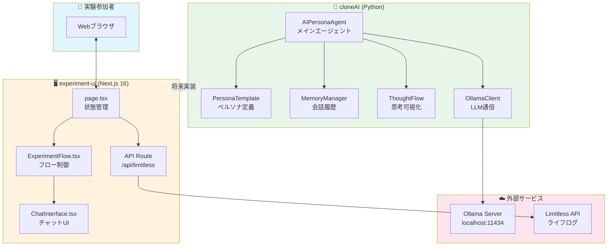
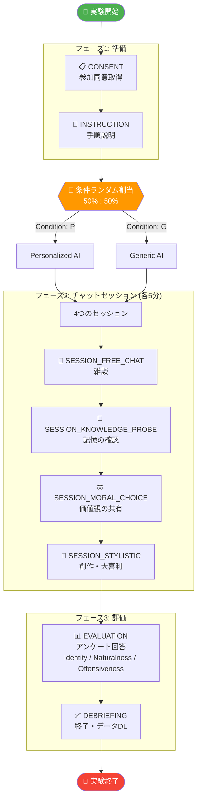
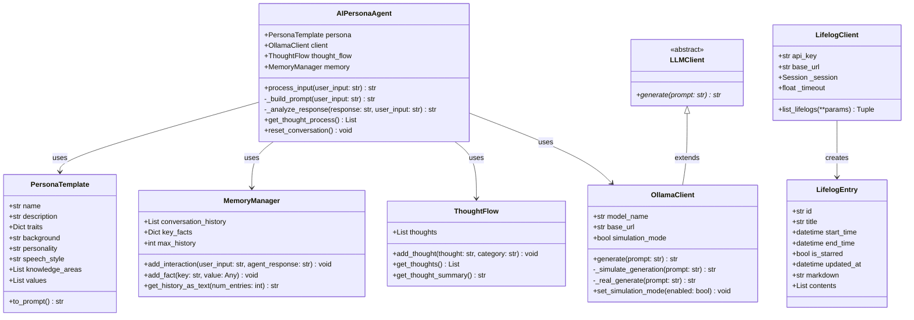
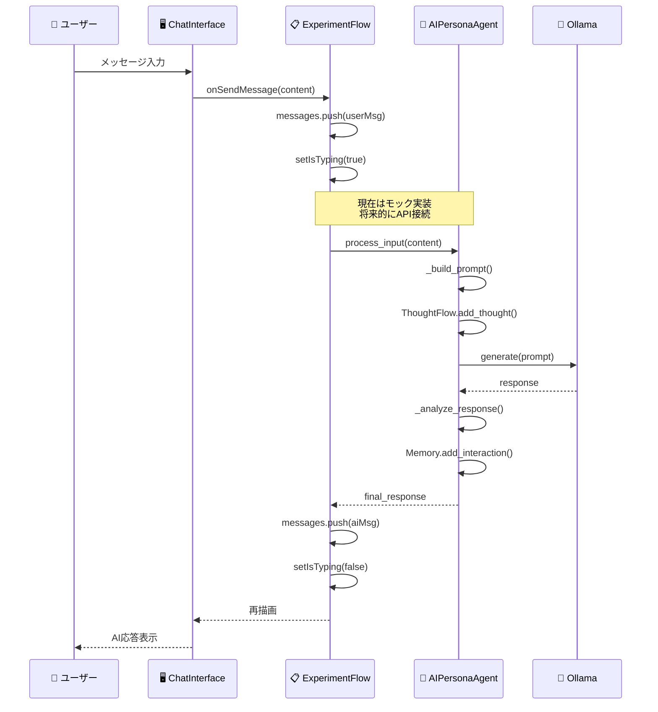
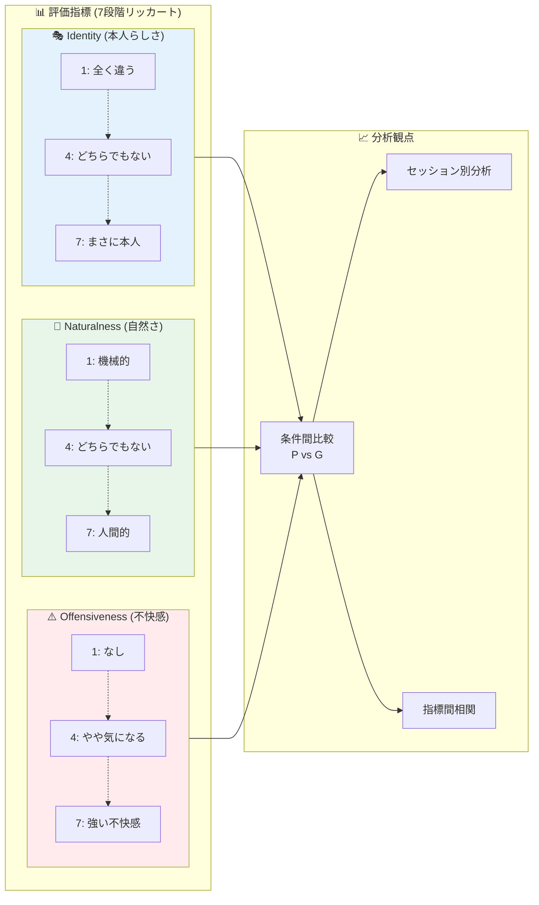
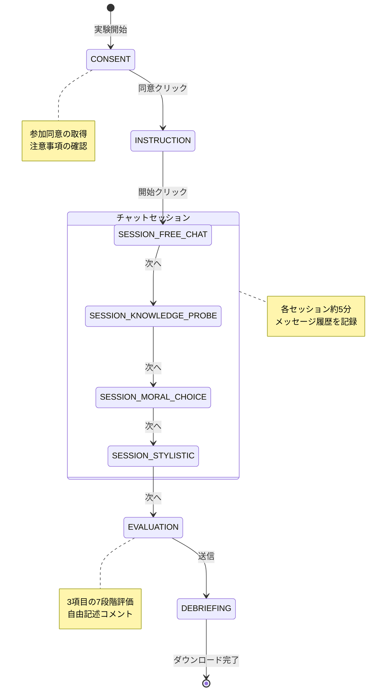
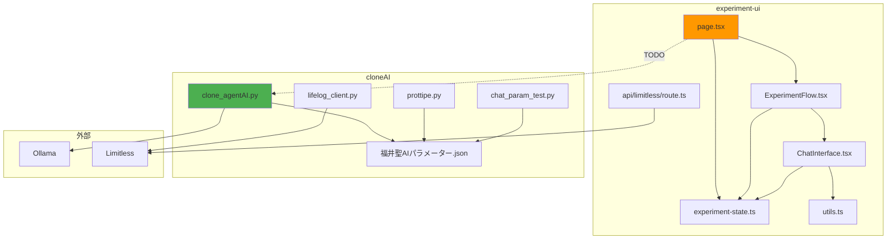

# 卒業研究システム概要図集

本ドキュメントは、システム設計ドキュメントの補足資料として、視覚的な図解を提供します。

---

## 1. システム全体構成図 (Mermaid)



---

## 2. 実験フローチャート (Mermaid)



---

## 3. クラス図 (Mermaid)



---

## 4. データフロー図 (Mermaid)



---

## 5. 評価指標ダイアグラム (Mermaid)



---

## 6. ディレクトリ構造図 (Tree)

```
卒研/
├── 📄 SYSTEM_DESIGN_DOCUMENT.md     # メイン設計ドキュメント
├── 📄 SYSTEM_DIAGRAMS.md            # 本ファイル（図集）
├── 📄 DIAGRAM_GENERATION_PROMPT.md  # 外部ツール用プロンプト
│
├── 🐍 cloneAI/                      # Pythonバックエンド
│   ├── clone_agentAI.py             # [645行] メインエージェント
│   ├── (削除) prottipe.py            # OpenAI直接呼出プロトタイプ（廃止）
│   ├── chat_param_test.py           # [641行] パラメータGUI
│   ├── 福井聖AIパラメーター.json      # AIパラメータ設定
│   ├── requirements.txt             # Python依存関係
│   ├── README.md                    # 使用方法
│   │
│   ├── 📁 src/
│   │   └── 📁 limitless_api/
│   │       ├── __init__.py          # パッケージ初期化
│   │       └── lifelog_client.py    # [205行] APIクライアント
│   │
│   └── 📁 tests/
│       ├── conftest.py              # テスト設定
│       ├── test_lifelog_client.py   # [82行] ユニットテスト
│       └── 📁 data/
│           └── lifelogs_sample.json # テストデータ
│
└── 🖥️ experiment-ui/                # Next.jsフロントエンド
    ├── package.json                 # Node依存関係
    ├── tsconfig.json                # TypeScript設定
    ├── next.config.ts               # Next.js設定
    ├── tailwind.config.js           # Tailwind設定
    │
    └── 📁 src/
        ├── 📁 app/
        │   ├── globals.css          # グローバルCSS
        │   ├── layout.tsx           # レイアウト
        │   ├── page.tsx             # [83行] メインページ
        │   │
        │   ├── 📁 api/limitless/
        │   │   └── route.ts         # [33行] APIプロキシ
        │   │
        │   └── 📁 limitless-test/
        │       └── page.tsx         # [74行] APIテストUI
        │
        ├── 📁 components/
        │   ├── ChatInterface.tsx    # [112行] チャットUI
        │   └── ExperimentFlow.tsx   # [266行] フロー制御
        │
        └── 📁 lib/
            ├── experiment-state.ts  # [54行] 型定義
            └── utils.ts             # [6行] ユーティリティ
```

---

## 7. 状態遷移図 (Mermaid)



---

## 8. コンポーネント依存関係図 (Mermaid)



---

## Mermaid図のレンダリング方法

### VS Code での表示
1. 拡張機能「Markdown Preview Mermaid Support」をインストール
2. Markdownプレビュー（Ctrl+Shift+V）で表示

### オンラインツール
- [Mermaid Live Editor](https://mermaid.live/)
- [GitHub](GitHubのMarkdownは直接Mermaidをレンダリング)

### 画像出力
```bash
# mermaid-cli インストール
npm install -g @mermaid-js/mermaid-cli

# SVG出力
mmdc -i SYSTEM_DIAGRAMS.md -o diagram.svg
```

---

**作成日**: 2025年12月9日
